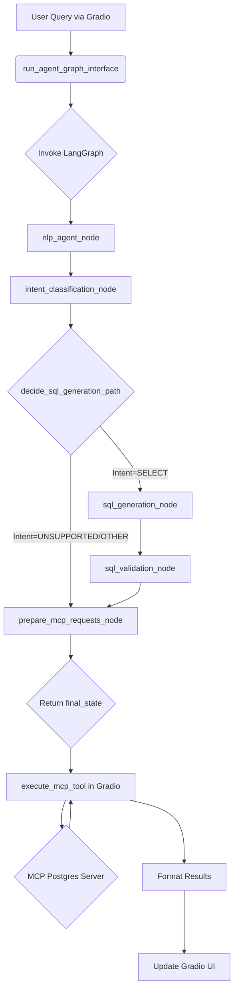

# PostgreSQL AI Agent (LangGraph + MCP Mode)

This project implements an AI agent capable of interacting with a PostgreSQL database based on natural language queries. It uses LangGraph for defining the agent's workflow, LangChain for LLM interaction, Gradio for the user interface, and the Model Context Protocol (MCP) for database interaction.

## Features

*   **Natural Language Querying:** Users can ask questions in natural language (e.g., "show me all people", "how many cars are there?").
*   **LLM-Powered SQL Generation:** Uses a Large Language Model (LLM) via Ollama (configurable) to translate natural language into SQL queries.
*   **Intent Classification:** Determines if the user's request is a `SELECT` query or an unsupported operation (INSERT, UPDATE, DELETE, etc.).
*   **SQL Validation:** Uses an LLM to perform basic validation and potential correction of the generated SQL.
*   **MCP Database Interaction:** Connects to a PostgreSQL database via a dedicated MCP server (`mcp_postgres_official`) to execute the generated `SELECT` queries.
*   **Gradio Web Interface:** Provides a user-friendly chat interface for interaction, displaying the conversation, agent steps, generated SQL, and query results.
*   **RAG (Retrieval-Augmented Generation):** Includes components for RAG using ChromaDB and OpenAI embeddings, although currently requires manual setup/population and an OpenAI API key.
*   **LangSmith Tracing (Optional):** Can be configured via environment variables to trace agent execution using LangSmith.

## Architecture & Workflow

The agent's logic is defined as a state machine using **LangGraph**. The core workflow involves the following steps (nodes):

1.  **`nlp_agent_node`:**
    *   Receives the user query and the database schema (loaded from `schema.json`).
    *   Uses an LLM to analyze the query and schema.
    *   Attempts to extract relevant table names and potentially refine the query for clarity.
    *   *Current Limitation:* JSON parsing of the LLM output can be brittle if the LLM includes extra text.

2.  **`intent_classification_node`:**
    *   Takes the (potentially refined) query.
    *   Uses simple keyword matching to classify the intent as `SELECT` or `UNSUPPORTED` (for DML/DDL) or `OTHER` (non-query).
    *   *Note:* Currently restricted to only allow `SELECT` queries due to MCP server limitations.

3.  **Conditional Routing (`decide_sql_generation_path`):**
    *   Based on the classified intent:
        *   If `SELECT`, routes to `sql_generator`.
        *   If `UNSUPPORTED` or `OTHER`, routes directly to `prepare_mcp_requests_node`, skipping SQL generation.

4.  **`sql_generation_node` (if intent is SELECT):**
    *   Receives the refined query, schema, and (optional) RAG context.
    *   Uses an LLM with a specific prompt to generate a single PostgreSQL `SELECT` statement.
    *   Outputs only the SQL string or an error message.

5.  **`sql_validation_node` (if SQL was generated):**
    *   Receives the generated SQL.
    *   Uses an LLM with a strict prompt to check for common mistakes and potentially correct the query.
    *   Outputs only the final (potentially corrected) SQL string.

6.  **`prepare_mcp_requests_node`:**
    *   Takes the validated SQL (if generated) or handles cases where SQL generation was skipped or failed.
    *   Prepares the request dictionary needed to call the `mcp_postgres` server's `query` tool via MCP.
    *   Prepares a request dictionary to log the SQL/error to a file via a (hypothetical) `mcp_filesystem` server.
    *   Generates the final response message for the user (e.g., confirming SQL generation, reporting errors, or stating an operation is unsupported).

7.  **`execute_mcp_tool` (within Gradio handler `app/main.py`):**
    *   Takes the prepared `mcp_query_request`.
    *   Uses the `mcp` Python library to connect to the `mcp_postgres_official` server via STDIO.
    *   Calls the `query` tool with the generated SQL.
    *   Receives the results (or error) from the MCP server.

8.  **Gradio UI (`app/main.py`):**
    *   Displays the chat history.
    *   Shows the agent's internal thought process (execution log).
    *   Displays the final generated/validated SQL.
    *   Shows the prepared MCP request dictionaries.
    *   Displays the actual query results received from the MCP server in a DataFrame.

### Workflow Diagram (Mermaid)



## Technologies Used

*   **Python:** Core programming language.
*   **LangChain:** Framework for LLM interaction, prompts, and chains.
*   **LangGraph:** Library for building stateful, multi-actor agent applications.
*   **Ollama:** Used for running local LLMs (e.g., Llama 3.2).
*   **Gradio:** Framework for building the web UI.
*   **MCP (Model Context Protocol):** Protocol used for interacting with the database via a dedicated server.
    *   `mcp` Python Library: Used by the Gradio app to act as an MCP client.
    *   `mcp_postgres_official` Server (External): Assumed to be running and accessible via STDIO, providing a read-only `query` tool.
*   **ChromaDB:** Vector database for RAG storage (SQL examples, GDrive docs).
*   **OpenAI Embeddings:** Used for generating embeddings for RAG (requires API key).
*   **Pydantic:** For data validation and settings management.
*   **python-dotenv:** For loading environment variables from `.env`.
*   **Pandas:** For displaying query results in the Gradio UI.

## Setup & Running

1.  **Prerequisites:**
    *   Python 3.11+
    *   Ollama installed and running with the required model pulled (e.g., `ollama pull llama3.2:latest`).
    *   An MCP server for PostgreSQL running and accessible (specifically the one defined in `app/utils/mcp_utils.py`'s `MCP_POSTGRES_PARAMS`). The current configuration expects the Node.js server from `modelcontextprotocol-servers/src/postgres` running with the specified connection string.
    *   (Optional) OpenAI API Key set in `.env` if RAG functionality is desired.
    *   (Optional) LangSmith API Key and configuration set in `.env` for tracing.

2.  **Clone the Repository:**
    ```bash
    # git clone ...
    # cd MCP_DOCKER
    ```

3.  **Create Virtual Environment:**
    ```bash
    python -m venv venv
    # Activate (Windows PowerShell)
    .\venv\Scripts\Activate.ps1
    # Activate (macOS/Linux)
    # source venv/bin/activate
    ```

4.  **Install Dependencies:**
    ```bash
    pip install -r requirements.txt
    ```

5.  **Configure Environment:**
    *   Copy `.env.example` to `.env` (if example exists) or create `.env`.
    *   Ensure `OPENAI_API_KEY` (optional, for RAG), LangSmith variables (optional), and PostgreSQL connection details used by the MCP server are correct.
    *   Verify the path to the MCP postgres server script in `app/utils/mcp_utils.py` (`MCP_POSTGRES_PARAMS`) is correct for your system.

6.  **Ensure `schema.json` is Present:**
    *   This file should contain a JSON representation of your target database schema. The agent currently relies on this static file.

7.  **Run the Application:**
    ```bash
    # Ensure any previous instances are stopped
    # On Windows:
    taskkill /F /IM python.exe /T
    # On macOS/Linux:
    # pkill -f 'python -m app.main'

    # Run the Gradio app
    python -m app.main
    ```
    *   The application will attempt to launch on port 7864 (or increment if needed). Access the UI via the URL provided in the console (e.g., `http://localhost:7864`).

## Current Limitations & Future Work

*   **DML/DDL Unsupported:** The agent currently only supports `SELECT` queries due to the read-only nature of the assumed MCP postgres `query` tool.
*   **Static Schema:** Relies on `schema.json`. Dynamic schema introspection was explored but deemed incompatible with the current architecture where MCP calls are made from the UI layer, not within graph nodes.
*   **NLP Robustness:** The NLP node's LLM call and JSON parsing could be more robust. Using dedicated JSON mode or output parsers might help.
*   **RAG Population:** The RAG vector stores are initialized but not populated. Functionality to add SQL examples or GDrive documents needs implementation (e.g., using the placeholder `kb_button` or automatically after successful queries).
*   **Error Handling:** MCP connection errors and query execution errors could be handled more gracefully in the UI.
*   **Security:** Executing arbitrary SQL generated by an LLM carries inherent risks. Further validation and potentially human-in-the-loop confirmation for complex queries would be advisable in a production setting.
*   **Configuration:** Embedding models and Ollama models are hardcoded in places; these could be moved to `settings`.
